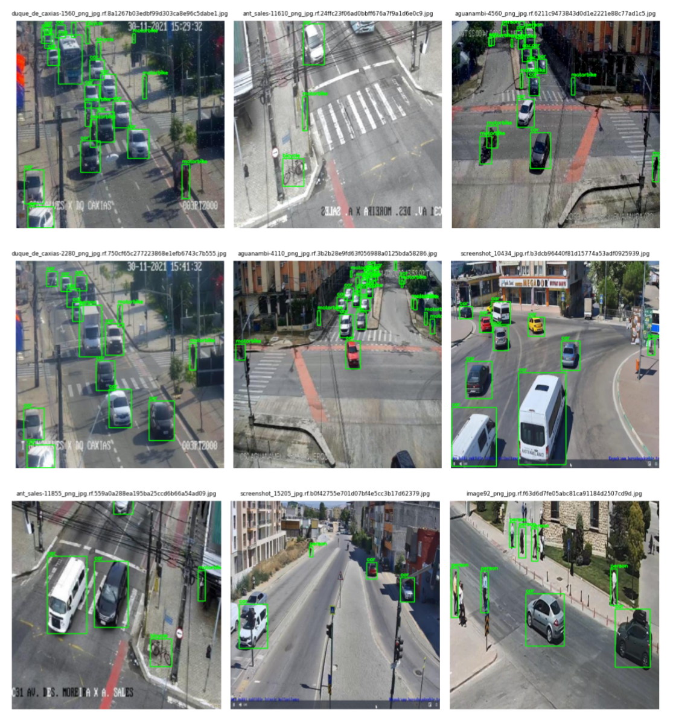

# Traffic Detection using YOLOv5

🚦 **AI-powered traffic detection using YOLOv5 for real-time object recognition in traffic imagery**

## 📘 Introduction

The objective of this project was to develop and optimise a traffic object detection model using the **YOLOv5** framework. By leveraging real-world traffic images, the model is trained to accurately detect and classify common objects in traffic scenes.

The system is designed to support applications in **traffic monitoring**, **road safety**, and **smart city infrastructure**, with a focus on maintaining real-time performance and high detection accuracy.

This project was developed as part of an academic collaboration by [Krzysztof Nazar](https://github.com/Danzigerrr) and [Hubert Nacmer](https://github.com/RicoPsych).

**Figure 1. Sample prediction of the final YOLOv5s model**

## 🗂️ Dataset

The dataset used is the [Traffic Detection Project](https://www.kaggle.com/datasets/yusufberksardoan/traffic-detection-project) from Kaggle. It comprises:

* Annotated traffic camera images from multiple countries.
* Variations in lighting conditions, road environments, and object densities.
* Bounding box annotations for **five object categories**:

  * `bicycle`
  * `bus`
  * `car`
  * `motorbike`
  * `person`

This variety ensures robust model generalisation to diverse real-world scenarios.

**Figure 2. Example image from dataset with annotated objects**

## 🧪 Data Augmentation

To improve model robustness, extensive augmentation techniques were applied using the **Albumentations** library:

* Horizontal flipping
* Shifting, scaling, rotating
* RGB channel shifting
* Brightness and contrast variation
* Blur augmentation

**Figure 3. Sample image after augmentation (brightness/contrast/blur)**

Additionally, a [Flip Mosaic](https://www.mdpi.com/2071-1050/14/19/12274) technique was integrated to enrich image composition.

**Figure 4. Sample image after augmentation (Flip Mosaic)**

Source of the image: *Zhang Y, Guo Z, Wu J, Tian Y, Tang H, Guo X. Real-Time Vehicle Detection Based on Improved YOLO v5. Sustainability. 2022; 14(19):12274. https://doi.org/10.3390/su141912274 (https://www.mdpi.com/2071-1050/14/19/12274)*

## ⚙️ Training & Optimization

* Framework: **YOLOv5s** (PyTorch-based)
* Hardware: NVIDIA RTX 4070 Ti (12GB VRAM)
* Key hyperparameters:

  * Image size: 640x640
  * Batch size: 60
  * Epochs: 50–60
* **Hyperparameter tuning** via YOLOv5’s genetic algorithm (`--evolve`) over 8 generations.

## 📈 Final Performance Metrics (on Test Set)

After all augmentations and hyperparameter optimization:

| Metric     | Value |
| ---------- | ----- |
| Precision  | 0.933 |
| Recall     | 0.904 |
| mAP\@50    | 0.945 |
| mAP\@50:95 | 0.707 |

These results demonstrate strong model performance and generalisation across diverse traffic scenes.

**Figure 5. Confusion Matrix of model with mosaic augmentation using test split.**

**Figure 6. PR Curve of model with mosaic augmentation using test split.**

## 🏋️ Key Achievements

* Outperformed Kaggle benchmark models with a significant boost in mAP.
* Maintained high precision and recall, even in images with high object density.
* Successfully applied advanced augmentation (flip mosaic) and automated hyperparameter tuning.

## 📄 Report

For a comprehensive explanation of model development, training procedures, and detailed evaluation, please refer to the full [project report](./Report%20-%20Traffic%20Detection%20using%20YOLO.pdf) included in this repository.

